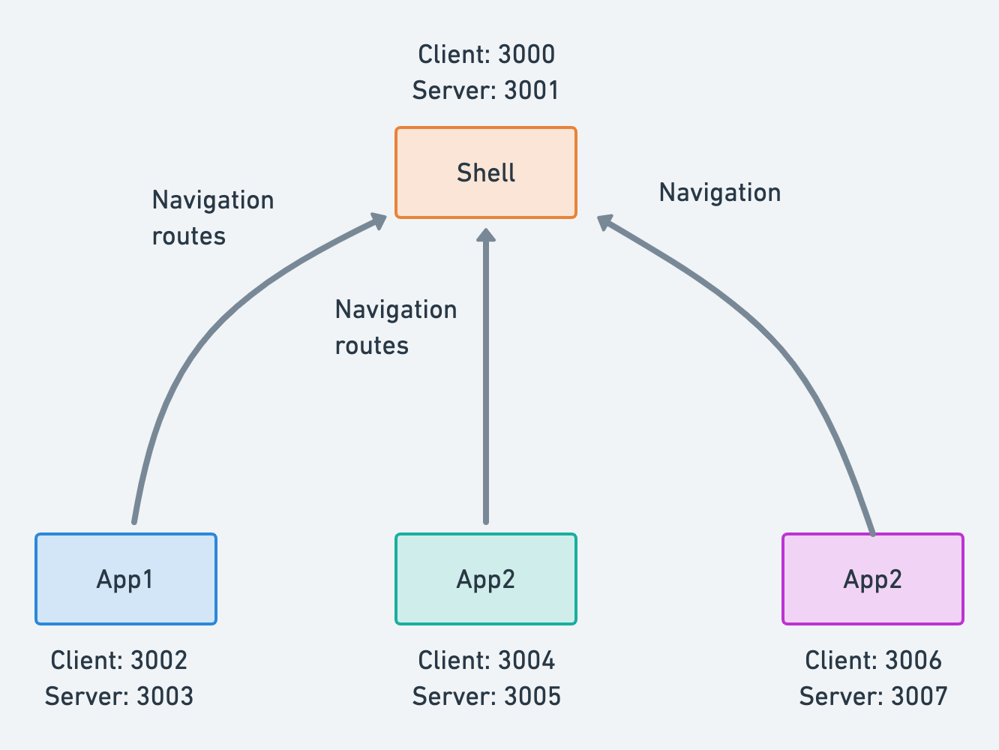
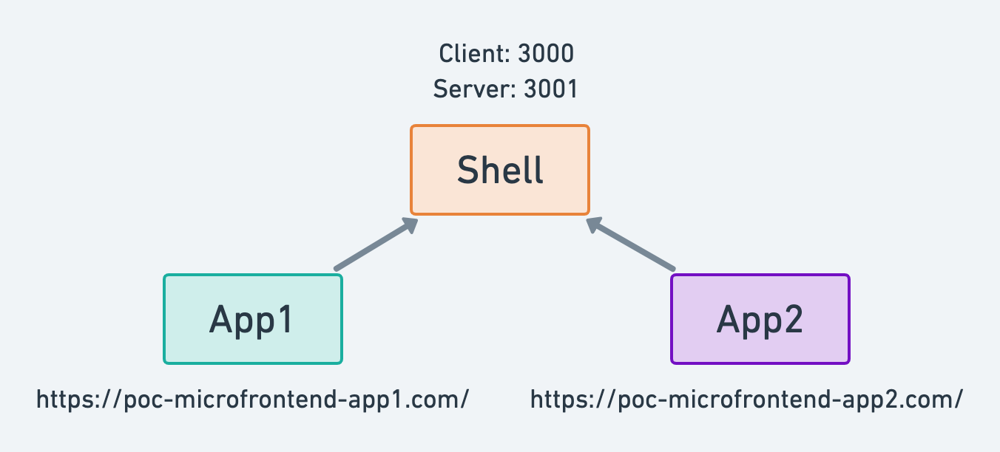

# Shared App Shell, React and Legacy apps Example

This example demos a basic host application loading remote component.



- `shell` is the App Shell - Share main Navigation
- `app1` - Standalone application - Contain React example
- `app2` - Standalone application - Contains Ajax, Iframe, SSR examples

# Running Demo

- `npm install`
- `npm run start`

This will build all the apps `shell`, `app1`, `app2` on different ports as shown below

- [localhost:3000](http://localhost:3000/) (HOST) - `shell - client (Main app)`
- [localhost:3001](http://localhost:3001/) (HOST) - `shell - server`
- [localhost:3002](http://localhost:3002/) (STANDALONE REMOTE) - `app1 - client`
- [localhost:3003](http://localhost:3003/) (STANDALONE REMOTE) - `app1 - server`
- [localhost:3004](http://localhost:3004/) (STANDALONE REMOTE) - `app2 - client`
- [localhost:3005](http://localhost:3005/) (STANDALONE REMOTE) - `app2 - server`

## Production mode

In case where you would like consume remote host instead of locale host you have to update the .env files. 

Example: Having Shell in a develop mode but App1 and App2 in a remote mode.



In `app1/.env`, `app2/.env` and `shell/.env`
   
- Comment: ```SHELL_URL=http://localhost:3000```
- Uncomment: ```SHELL_URL=https://poc-microfrontend-shell.herokuapp.com```

